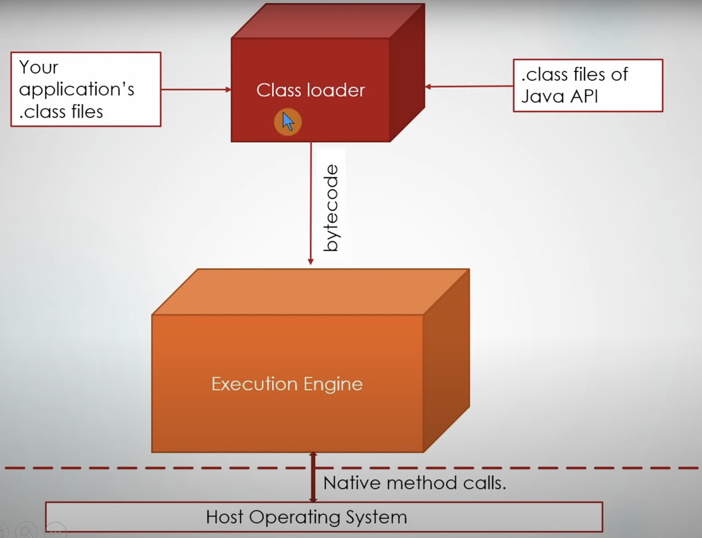
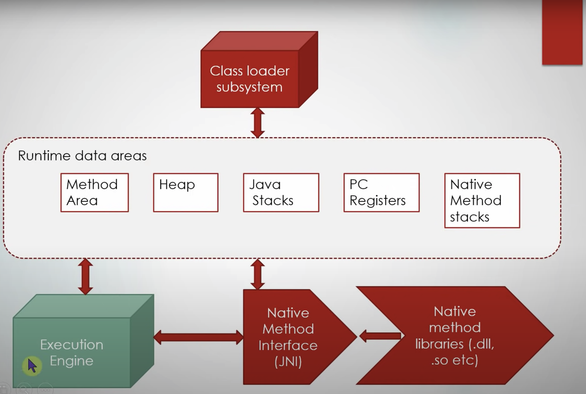
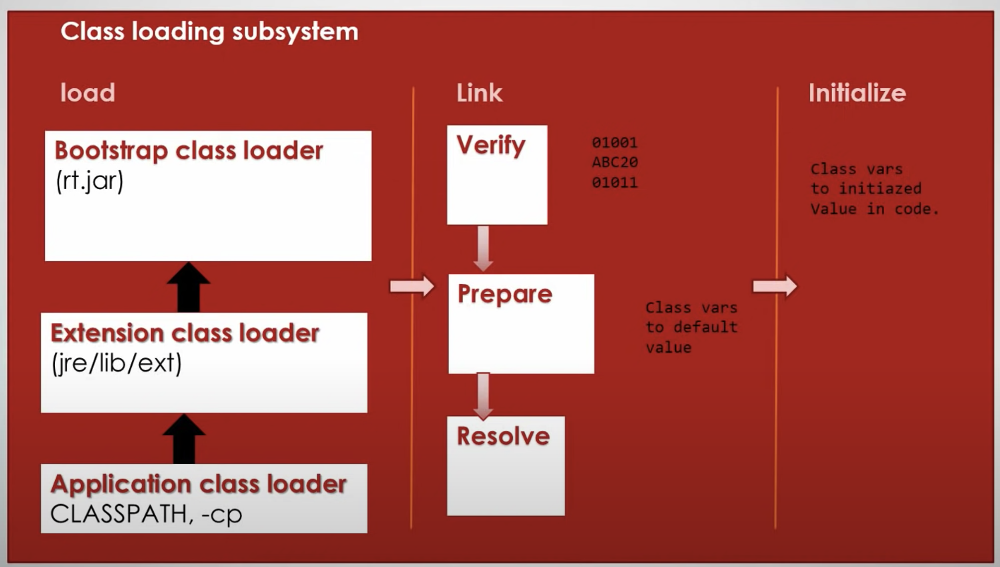
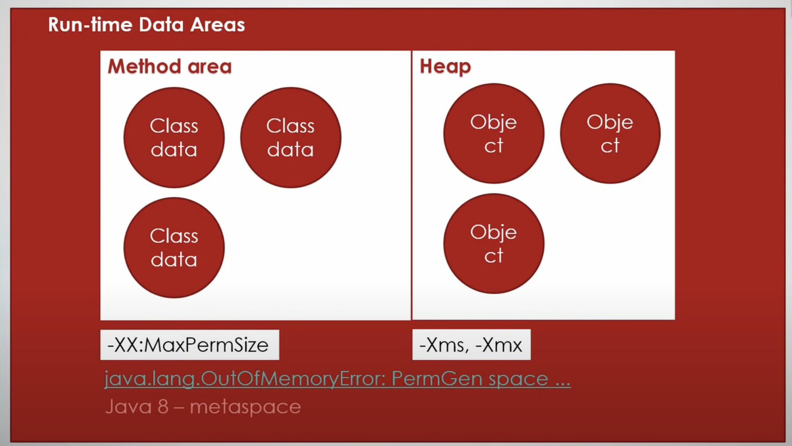
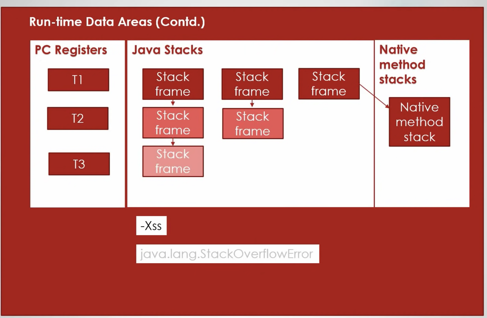
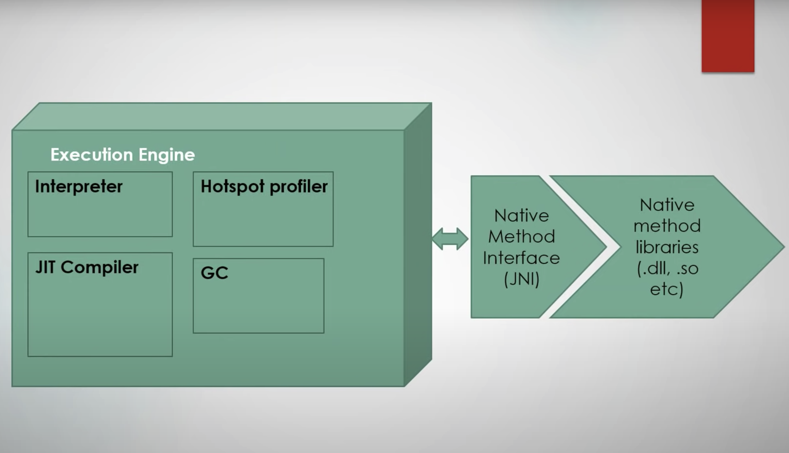
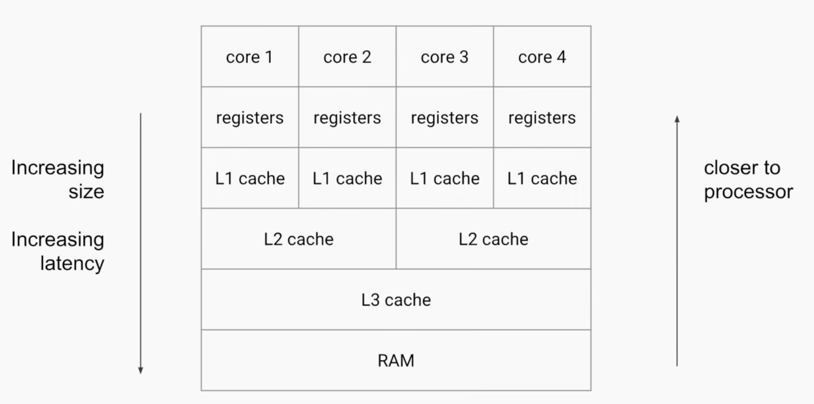
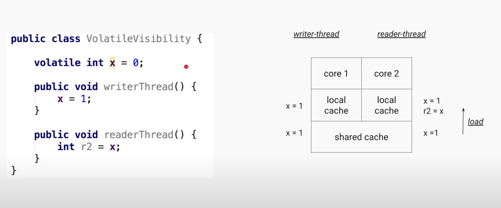
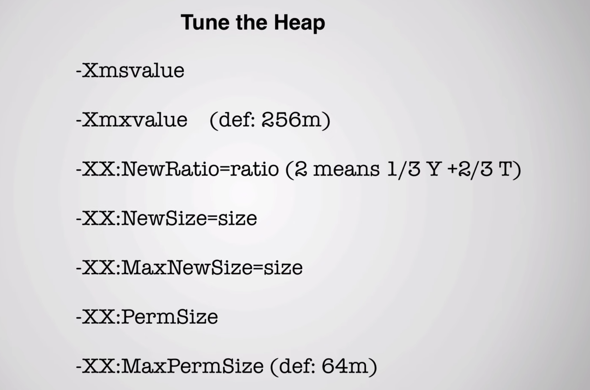

# Core Java Concepts

### JVM ( java virtual machine) architecture

JVM's responsibility is - To load and Execute you application files

- Class Loader - Class Loader is responsible to load .class files related to app and built in by JAVA API
- Runtime Data Areas - Memory Instantiation and Allocation
- Execution Engine - These bytecode is then executed by execution engine for which native calls are made to Host OS.

#### Class Loader Subsystem

There are three phases in Class Loader

<ul>
  <li> Load </li>
    <ul>
      <li>Bootstrap Class Loader - Responsible for loading Java's internal classes</li>
      <li>Extension Class Loader - Additional classes jre/lib/ext</li>
      <li>Application Class Loader - Load classes from your applications classPath + -cp params</li>
    </ul>
  <li> Link </li>
    <ul>
      <li>Verify - Checks bytecode is compatible with JVM Specification</li>
      <li>Prepare - Memory is allocated to static vars and assign default values</li>
      <li>Resolve - All symbolic references are resolved</li>
    </ul>
  <li> Initialize - Static blocks are executed, and values are assigned to static vars</li>
</ul>	

#### Runtime Data Areas

<ul>
    <li> Method Area - Metadata corresponding to class is stored, static variables, also knows as PermGen space (64 Mb), after Java 8 PermGen is replaced by Metaspace which has infinite memory (As much as the OS) </li>
    <li> Heap - Object data is stored</li>
    <li> PC Registers - Pointer to next instruction to be executed per thread</li>
    <li> Java Stacks - Stack Frame related to current method execution , will have related stacks of method calls</li>
    <li> Native Method Stacks - Method calling native libs .dll etc </li>
</ul>

#### Execution Engine

<ul>
    <li> Interpreter - Interprets the current instruction in bytecode and figures out what native operation is to be done and using JNI does it</li>
    <li> JIT Compiler - If an instruction is being called a lot of times, and it compiles these set of instruction and executes it without interpreting thus saving time</li>
    <li> Hotspot Profiler - Keeps an eye on the bytecode that are running, grabs different stats and tells JIT compile frequently used instructions  </li>
    <li> GC - Cleans up unused objects, classes etc</li>
</ul>

[More about different GC's](GarbageCollector.md)

### Java Memory Model

- Order of execution - Performance driven done by Compiler, JVM or CPU
- Field Visibility - In presence of concurrency

JMM is a specification which guarantees visibility of fields (AKA happens before) amidst of reordering of instructions. Can be solved using Synchronised, Locks, Concurrent Collections, Thread Operations (Join,Start), Final Fields etc. 

Heap Tuning

