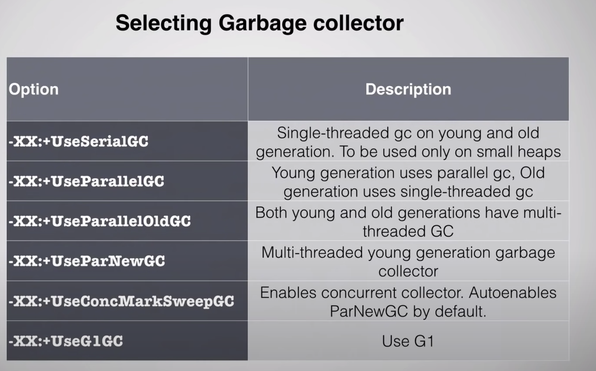
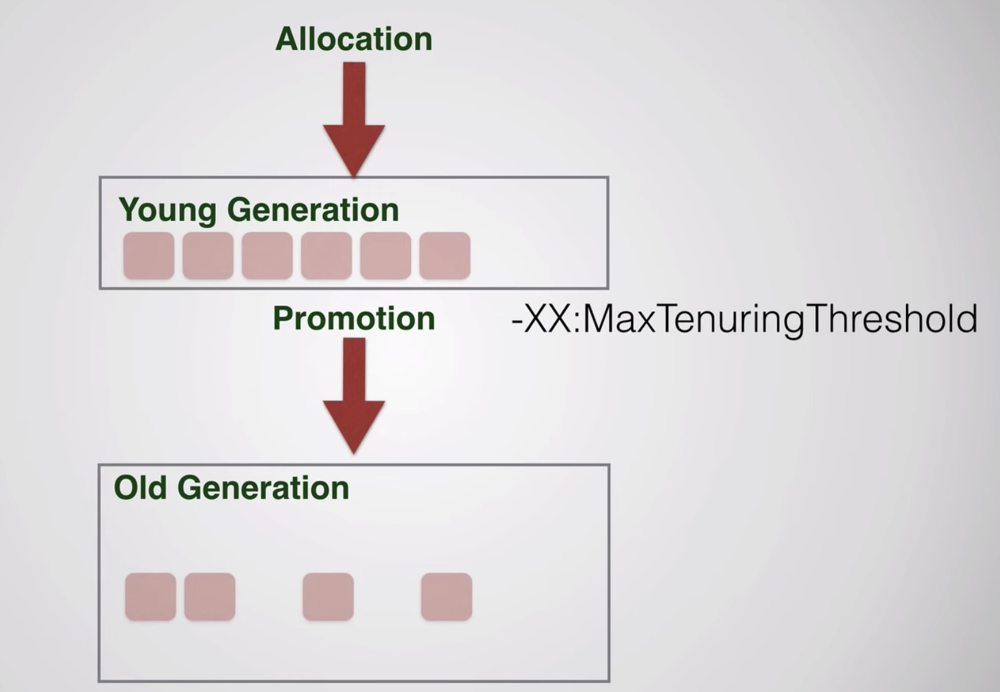
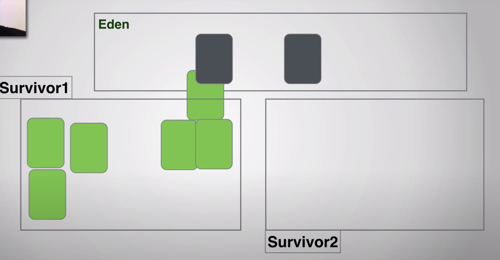

## Garbage Collection

### Resources

- [GC Overview by Martin Thompson](http://mechanical-sympathy.blogspot.in/2013/07/java-garbage-collection-distilled.html) - Highly recommended
- [Detailed overview of all GC collectors](https://plumbr.eu/handbook/garbage-collection-algorithms-implementations)
- [Modern Garbage Collection (GC Trade-offs)](https://blog.plan99.net/modern-garbage-collection-911ef4f8bd8e#.qcnv033nr)
- [Internals of G1 collector](https://www.youtube.com/watch?v=Gee7QfoY8ys)
- [Overview of Shenondoah collector](https://www.youtube.com/watch?v=N0JTvyCxiv8)
- [Garbage collection in Java, with Animation](https://www.youtube.com/watch?v=UnaNQgzw4zY)

### Quick Glance

| Collector | Pros | Cons | Use-Case |
| --- | --- | --- | --- |
| Serial | Fast promotion and minor GC (Bump the pointer) Smallest footprint | Single Thread | Limited memory (embedded).  CPU running lot of JVMs (helps limit GC impact other JVMs) |
| Parallel | Fast promotion and minor GC (Bump the pointer) Higher Throughput (doesn&#39;t run with application) | High worst-case latency (due to compaction) | Batch applications |
| CMS | Low STW pauses (Concurrent mark). Low worst case latency. | Slow promotion &amp; Minor GC (free lists) Reduced throughput Higher footprint. | General applications |
| G1 | Incremental collection Lower worst case latency Relatively faster promotion (no free lists)  More throughput (no compaction) | Higher footprint  | Predictable/Target latency applications. Large heaps |
| Shenondoah |  Lower latency  | Higher footprint | Even lower latency  Much Larger heaps  |

### Concepts

- Throughput - Percentage of time application runs vs GC
- Latency - Amount of pause time for application waiting for GC to complete
- Memory - Amount of memory used to store the objects aka heap (along with GC related data structures)

### Trade offs

- If memory is less, throughput is less, because JVM has to constantly do GC
- If memory is more, latency is high, because JVM has to sweep huge space to do GC

### Use cases

- For trading applications, deterministic (more average) latency is better than sudden spikes (increased worst case latency).
- For batch applications, it might be ok for increase worst case latency, if it helps gain more throughput

### Tweaks

- To large extent, more memory for GC helps in increasing throughput
- Worst case latency can be reduced by keeping heap size small (&amp; live set small)
- Frequency of GC can be reduced by managing heap &amp; generation sizes
- Frequency of large pauses can be reduced by running GC with application, sometimes at cost of throughput (because it runs longer due to 2 STW pauses, and one thread is used by GC which could&#39;ve been used by application).

### Object lifetimes

- Infant mortality / Weak generational hypothesis - Most objects die young.
- Thus, generational GC algorithms provide magnitude-of-order better throughput.
- How? Region with newly allocated object is sparse for live objects, they can be quickly copied over and region can be wiped entirely.
- If application keeps allocating objects that live too long. The generational split becomes useless, and GC takes long time. Because old generation is too big (&amp; not so sparse).
- Lifetime of object is recorded by JVM as number of GC cycles survived.

### Stop the World Events

- Collectors need application execution to stop for practical reasons.
- Threads are signalled to stop. Threads stop when they reach safe points of execution.
- If thread is busy (copying large array, cloning a large object), it might be few milliseconds till this point.
- ‑XX:+PrintGCApplicationStoppedTime this flag is used to print the time taken to reach safe point.
- Once GC STW event is over, all threads are free to resume. An application with large number of threads can suffer scheduling pressure. It might be more efficient to use different collector then.

### Heap organization in HotSpot

- Heap is split in Young and Old (Tenured) generation
- Young generation is split in - Eden and Survivor (1,2) spaces
- PermGen is used to store effectively immortal objects (Classes, static strings etc).
- In Java 7, interned Strings were removed from PermGen.
- In Java 8, PermGen space itself is replaced by MetaSpace.

### Object allocation

- Each thread is assigned TLAB (Thread Local Allocation Buffer) to allocate new objects.
- Since there is no conflict between threads, object allocation is just a bump-the-pointer, and is faster than MALLOC in C. Roughly 10 machine instructions.
- When TLAB is exhausted new TLAB is requested from Eden. If Eden is filled, Minor GC is triggered.
- If a large object (size greater than TLAB) is to be allocated, it is done directly in Eden or Old Generation.
- -XX:PretenureSizeThreshold=&lt;n&gt; If this is smaller than TLAB, then small objects are still allocated in TLAB itself, not in Old generation.

### Minor Collection

- Called when Eden is full.
- Live objects are moved to one of the survivor spaces.
- If survivor space is full or object has live too long (XX:MaxTenuringThreshold=&lt;n&gt;) it is moved to tenured generation.
- Major cost of minor collection is in copying live objects to survivor / old generation. Thus, overall cost depends on number of objects to be copied not the size of Eden.
- Thus, if new generation size is doubled, total minor GC time is almost halved (thus increasing the throughput). Assuming number of live objects remain constant.
- Minor collections are STW events. This is becoming an issue as heaps are getting larger, with more and more live objects.
- This algorithm is called mark-and-copy

### Marking Live Objects

- All objects in graph starting from GC Roots
- GC roots = references from application, JVM internal static fields and thread stack-frames
- References from old generation to young generation (aka cross generational references) are also tracked
- Card tables are used for this. Card tables are array of bytes. Each byte represents 512 bytes of old gen. If byte is set, it means corresponding 512 bytes of old gen has reference to young gen objects.
- During minor collection, all such cards are checked, then all those 512 byte regions are checked for references. Thus, minor collection latency also depends on number of old gen to young gen references.

### Major Collection

- JVM tries to predict, set % threshold and start collection when threshold is passed.
- When object cannot be promoted from younger gen due to lack of space in old gen, then FullGC is triggered.
- FullGC = minor collection + major collection (including compaction).
- FullGC is also triggered when old gen size needs to be changed. This can be avoided by keeping Xms same as Xmx
- Compaction is likely to cause largest STW

### Serial Collector

- Smallest footprint of any collectors
- Uses single thread for both minor and major collections.
- Objects in old gen are allocated with simple bump the pointer technique
- Major GC is triggered when old gen is full

### Parallel Collector

- Parallel Collector - Multiple threads for minor GC, and single thread for major GC.
- Parallel Old Collector - Multiple threads for both minor and major GC. Default since Java 7u4
- Doesn&#39;t run with the application.
- Greatest throughput in multi-processor systems. Great for batch applications.
- Cost of Old GC, is proportional to number of objects, thus doubling old gen size can help in increasing throughput (larger but fewer GC pauses).
- Minor GCs are fast because promotion in old gen is just bump-the-pointer.
- Major GC takes 1-5 seconds per live data
- Allows for -XX:+UseNUMA to allocate Eden space per CPU socket (can increase performance)

### Concurrent Mark and Sweep

- Parallel (multiple threads) for Minor GC
- Runs with application to try to avoid promotion failure. Promotion failure causes FullGC.
- CMS =
    - Initial mark = Find GC roots
    - Concurrent mark = mark all objects from GC root
    - Concurrent pre-clean = check for updated object references &amp; promoted objects during mark (Card Marking technique)
    - Re-mark = mark all objects in pre-clean
    - Concurrent sweep = reclaim memory and update free-lists
    - Concurrent reset = reset data structures used
- During concurrent sweep, promotions can occur, but those are in free-lists which are not being swept anyways. So there is not conflict.
- Minor GCs can keep happening while Major GC is happening! Thus the pre-clean phase.
- Slower minor GCs during promotion. Cost of promotion is higher since, free-lists have to be checked for suitable sized hole.
- CMS is not compacting collector, so when object promotion fails due to not having enough space in free-lists. CMS is followed by compaction. This latency can be worse than Parallel Old collector.
- Decreases latency, but less throughput. Avg ¼ GC threads per 1 CPU core.
- Throughput reduction between 20-40% compared to parallel collector (&amp; based on object allocation rate).
- 20% more space required.
- &quot;Concurrent mode failure&quot; - When CMS cannot keep up with high promotion rates. Increasing heap makes it even worse, because sweeping will take even more time.

### [G1 Garbage First](https://www.youtube.com/watch?v=Gee7QfoY8ys)

- Soft real-time targets. Spend x milliseconds in GC out of y milliseconds.
- Divides heap into large regions ~2048
- Categorizes regions in Eden, Survivor and Old gen spaces.
- Minor GC is triggered, when all Eden regions are filled.
- Selects closest set of nearly free regions (called Collection Set), to move live objects, essentially causing regions to be empty. Thus it approaches problem incrementally, as opposed to CMS which has to perform on entire Old gen.
- Objects larger than 50% of region are saved in &quot;humungous region&quot;
- Regions can have objects being referenced from multiple other regions. These are tracked using Reference Sets. Thus, while moving live objects, all the references to such objects need to be updated. Thus, even minor collections can potentially be longer than Parallel or CMS collector.
- It avoids collecting (moving) from regions which have high references. Unless it has no other option.
- G1 is target driven on latency –XX:MaxGCPauseMillis=&lt;n&gt;, default value = 200ms
- G1 reduces worst case latency, at the cost of higher average latency.
- Compactions are piggybacked on Young Gen GC.
- During reference changes, cards (arrays pointing to 512 bytes of a region) are marked dirty, and source-target details are placed in dirty card queue. Depending on number of elements in queue (white, green, yellow, red) G1 starts threads which take information from queue and write to Remembered Set. More the queue is full, more G1 threads try to drain it. Remembered set will be heavily contended if all threads directly write to RS, its better if only specific G1 threads (1 or 2) write to them.
- If Young GC cannot finish within maxTargetPauseTime, then # of Eden regions are reduced to finish within the target.
- Old GC is triggered when total 45% is full, and is checked just after Young GC or after allocating humongous object.

### [Shenandoah](https://www.youtube.com/watch?v=N0JTvyCxiv8)

- 10% hit in throughput, but 7x more responsive.
- Avg Pause 5x better - 60ms (vs 600ms in G1).
- Max Pause 3x better - 500ms (vs 1700ms). Lot of headroom.
- Target - 10ms average, and max 100ms.
- Region based like G1 (remembered sets, collection sets)
- Concurrent mark and sweep same as CMS and G1
- It does compaction though + concurrently while threads are running
- Trick is to create indirection pointer to objects, and after copying live objects, atomically update the indirection pointer to copied version of the objects.
- Not Generational. Claim is, Weak Generational Hypothesis is no longer applicable.

### Other pauses not related to GC

- Networking, Disk read/writes, Waiting for DBs
- OS interrupts (~5ms), this doesn't show up in logs
- Lock contention